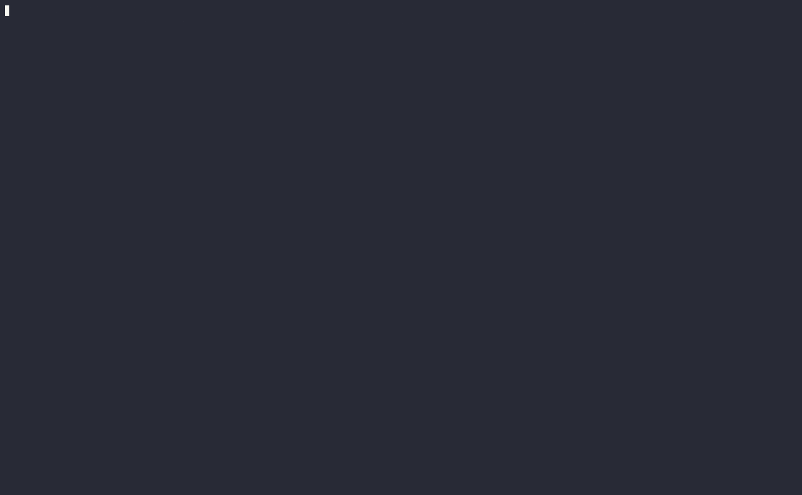

# GoUpload 🚀

<p align="center">
  
</p>

**Web Application File Upload Security Tester**

A high-performance, concurrent file upload vulnerability scanner written in Go. Tests for 344+ file upload vulnerabilities across 13 attack modules including extension bypass, content-type spoofing, magic bytes, path traversal, race conditions, XXE injection, GraphQL uploads, RCE auto-verification, and ML-powered detection.

## ⚠️ Disclaimer

This tool is for security professionals and penetration testers only. Always obtain proper authorization before testing any system. The author is not responsible for misuse or damage caused by this tool.


## ⚡ Features

- **Smart Fingerprinting** - Auto-detects target tech stack (PHP, ASP.NET, Java, Node.js, Python)
- **344+ Payloads** - Comprehensive test matrix across 13 attack modules
- **RCE Auto-Verification** - Confirms RCE on vulnerable uploads with proof (`uid=`, command output)
- **ML-Powered Detection** - Optional ML server integration for confidence scoring
- **GraphQL Support** - Tests GraphQL file upload mutations with custom mutation strings
- **Race Condition Testing** - TOCTOU detection with synchronized burst execution
- **XXE Injection** - XML External Entity via SVG, DOCX, XLSX, JPEG uploads
- **Polyglot & Archive Attacks** - GIF+PHP, SVG XSS/XXE, ZIP slip, ZIP bomb, PDF JS
- **Server Config Overrides** - .htaccess, web.config, .user.ini, nginx.conf, web.xml
- **Upload Form Discovery** - Auto-discovers hidden upload endpoints in HTML forms
- **Risk Scoring** - CRITICAL/HIGH/MEDIUM/LOW/INFO classification
- **Confidence Scoring** - 0-100% confidence per finding
- **Nuclei-Style Tables** - Professional findings table with summary cards
- **Template System** - YAML-based attack profiles with regex matchers
- **Module Selection** - Run specific modules with `--module` flag
- **Blazing Fast** - Concurrent testing (344+ tests in <1s)
- **Beautiful Output** - Rainbow ASCII art with colored results
- **Target Validation** - Validates URLs before testing
- **Cross-Platform** - Linux, Windows, macOS
- **Docker Support** - Multi-stage Dockerfile with Docker Compose

## ML Integration — Coming Soon

> **Status: Under Development  Model Training Incomplete**

GoUpload is getting machine learning–powered vulnerability detection. A Python FastAPI ML server is currently in active development to provide:

- Confidence scoring for each finding

- False positive reduction using trained classifiers

- Ground truth labeling from RCE auto-verification

- Hybrid verdicts combining oracle heuristics + ML predictions

⚠️ Model training is incomplete. The current model is a work-in-progress and predictions should not be relied on for production scans yet.

### Preview (Experimental)

```bash
# Requires ML server running at localhost:5000
GoUpload -u http://target.com/upload -p file \
  --ml \
  --ml-server http://localhost:5000 \
  --verify-rce
```
### Expected output (experimental):

```bash 
{
  "filename": "shell.php5",
  "verdict": "VULNERABLE",
  "ml_label": "VULNERABLE",
  "ml_confidence": 0.92,
  "rce_verified": true
}
```

Stay tuned — stable release coming in a future version. 🚀

**Want to contribute training data?** Run scans with `--verify-rce` `--output json` and share the labeled findings to help improve the model.

## 📦 Installation

### Method 1: Go Install (Recommended)
```bash
go install -v github.com/HaakimSec/GoUpload@latest
```

### Post-Installation Setup (Add to PATH)
If your terminal says `GoUpload: command not found`:

#### For Bash:
```bash
echo 'export PATH=$PATH:$HOME/go/bin' >> ~/.bashrc && source ~/.bashrc
```

#### For Zsh:
```bash
echo 'export PATH=$PATH:$HOME/go/bin' >> ~/.zshrc && source ~/.zshrc
```

#### Verification:
```bash
GoUpload -v
# Output: GoUpload v1.8.2
```

### Method 2: Build from Source
```bash
# Linux/MacOS
git clone https://github.com/HaakimSec/GoUpload.git
cd GoUpload
go build -o GoUpload main.go
sudo mv GoUpload /usr/local/bin/
```

```bash
# Windows: move to a directory in your PATH
git clone https://github.com/HaakimSec/GoUpload.git
cd GoUpload
go build -o GoUpload.exe main.go

# Option 1: Move to C:\Windows (Requires Administrator PowerShell)
Move-Item GoUpload.exe C:\Windows\

# Option 2: Move to a user bin directory and add it to your PATH
New-Item -ItemType Directory -Path "$env:USERPROFILE\bin" -Force
Move-Item GoUpload.exe "$env:USERPROFILE\bin\"
[Environment]::SetEnvironmentVariable("Path", $env:Path + ";$env:USERPROFILE\bin", "User")
```

### Method 3: Docker 

#### Quick Start

```bash 
# Build image from source (run from repository root)
docker build -t goupload:latest .

# Show version
docker run --rm goupload:latest -v

# Show help
docker run --rm goupload:latest --help
```

#### Simple Check Scan

```bash
docker run --rm goupload:latest \
  -u http://target.com/upload \
  -p file \
  --check
```

#### Full Scan

```bash
docker run --rm goupload:latest \
  -u http://target.com/upload \
  -p file \
  --allow-list .jpg,.png \
  --no-validate
```

#### With RCE Verification

```bash
docker run --rm goupload:latest \
  -u http://target.com/upload \
  -p file \
  --verify-rce \
  --no-validate
```

## 🛠️ Usage

### Quick Start
```bash
# Show version
GoUpload -v

# List all 13 modules
GoUpload --list-modules

# Basic scan
GoUpload -u http://target.com/upload -p file

# Auto-detect tech stack
GoUpload -u http://target.com/upload --auto-detect

# Run specific modules
GoUpload -u http://target.com/upload -p file --module extension,path-traversal

# Full scan with baseline
GoUpload -u http://target.com/upload -p file --allow-list ".txt,.jpg,.png" -c 20
```

### Module Selection
```bash
# Run single module
GoUpload -u http://target.com/upload --module xxe

# Run multiple modules
GoUpload -u http://target.com/upload --module extension,content-type,graphql

# Available modules (13 total):
# extension, content-type, magic-byte, filename, path-traversal,
# graphql, unicode, size-boundary, race-condition, polyglot,
# xxe, server-config, template
```

### RCE Auto-Verification
```bash
# Automatically verify RCE on vulnerable uploads
GoUpload -u http://target.com/upload -p file --verify-rce

# Shorthand
GoUpload -u http://target.com/upload -p file -rce

# Combine with polyglot module for maximum impact
GoUpload -u http://target.com/upload -p file \
  --module polyglot,extension \
  --verify-rce

# Example output:
# 🚀 Verifying RCE on 2 vulnerable uploads...
# 🔍 Testing shell.php5... ✅ RCE CONFIRMED
#    Proof: uid=33(www-data) gid=33(www-data) groups=33(www-data)
#    URL: http://target.com/uploads/shell.php5?cmd=id
```

### ML-Powered Detection
```bash
# Enable ML predictions (requires ML server running)
GoUpload -u http://target.com/upload -p file --ml

# Custom ML server URL
GoUpload -u http://target.com/upload -p file \
  --ml --ml-server http://localhost:5000

# Adjust confidence threshold (higher = fewer false positives)
GoUpload -u http://target.com/upload -p file \
  --ml --ml-confidence 0.75

# ML + RCE verification (best accuracy)
GoUpload -u http://target.com/upload -p file \
  --ml --ml-server http://localhost:5000 \
  --verify-rce
```

**Starting the ML server:**

```bash
# Terminal 1 — Start ML server
cd ml-server
python3 -m venv venv
source venv/bin/activate
pip install -r requirements.txt
python3 model_server.py
# ✅ Model loaded: RandomForestClassifier
# INFO: Uvicorn running on http://0.0.0.0:5000

# Terminal 2 — Run GoUpload with ML
GoUpload -u http://target.com/upload -p file --ml --verify-rce
```

**ML + JSON output** (for dataset generation):

```bash
GoUpload -u http://target.com/upload -p file \
  --ml --ml-server http://localhost:5000 \
  --verify-rce \
  --output json --output-file ml-dataset.json

# Extract ML fields
cat ml-dataset.json | jq '.findings[] | {
  filename,
  verdict,
  ml_label,
  ml_confidence,
  rce_verified,
  rce_proof
}'
```

Example output:
```json
{
  "filename": "shell.php5",
  "verdict": "VULNERABLE",
  "ml_label": "VULNERABLE",
  "ml_confidence": 0.92,
  "rce_verified": true,
  "rce_proof": "uid=33(www-data) gid=33(www-data)"
}
```

### JSON Output
```bash
GoUpload -u http://target.com/upload -p file \
  --output json --output-file results.json

# Pretty print with jq
cat results.json | jq '.summary'
cat results.json | jq '.findings[] | select(.verdict=="VULNERABLE")'
```

### Upload Form Discovery
```bash
# Discover upload forms on a page
GoUpload -u https://target.com/profile --discover

# Output:
# 🔍 Discovered 1 upload surface(s)
# [1] Upload Form
#     Method:       POST
#     Action:       /api/user/avatar
#     File field:   avatar
```

### Complete Workflow Examples

**Full pentest scan with all features:**

```bash
GoUpload -u http://target.com/upload -p file \
  --allow-list ".txt,.jpg,.png" \
  --tech php \
  --verify-rce \
  --ml --ml-server http://localhost:5000 \
  --output json --output-file full-scan.json \
  -c 20
```

**CTF / lab testing:**

```bash
GoUpload -u http://localhost:8080/upload_unrestricted.php \
  -p file -d "upload=1" \
  --module extension \
  --verify-rce \
  --no-validate
```

**WordPress File Manager (CVE-2020-25213):**

```bash
GoUpload -u "http://target.com/wp-content/plugins/wp-file-manager/lib/php/connector.minimal.php" \
  -p "upload[]" \
  -d "cmd=upload&target=l1_Lw" \
  -H "Accept: application/json" \
  --template templates/cms/wp-rce-final.yaml \
  --verify-rce \
  --no-validate
```

**GraphQL upload testing:**

```bash
GoUpload -u https://api.target.com/graphql \
  --graphql-mutation "mutation(\$file:Upload!){uploadFile(file:\$file){id}}" \
  --graphql-variable file \
  --tech nodejs \
  --verify-rce
```

**Authenticated upload testing:**

```bash
GoUpload -u https://dashboard.target.com/api/upload \
  -p document \
  -H "Cookie: session=abc123; XSRF-TOKEN=xyz789" \
  -H "X-CSRF-TOKEN: xyz789" \
  -d "_token=xyz789" \
  --module extension,content-type,polyglot \
  --verify-rce \
  --no-validate
```

### Full Flag Reference

```text
Flags:
  -u, --url              Target upload endpoint URL (required)
  -p, --param            File parameter name (default: "file")
  -t, --tech             Tech stack: php, asp.net, java, nodejs, python, all, auto (default: "all")
      --auto-detect      Auto-detect tech stack via fingerprinting
  -c, --concurrency      Concurrent workers (default: 10)
      --allow-list       Allowed extensions for baseline (comma-separated)
  -H, --headers          Custom headers as key:value pairs or JSON file path
  -d, --data             Additional form fields as key:value pairs
      --check, -C        Validate target only (no payloads)
      --no-validate      Skip target validation before testing
      --discover         Discover upload forms on target page
  -m, --module           Run specific modules (comma-separated)
      --list-modules     List available modules and exit
      --list-templates   List available templates
      --template         Path to template YAML file
      --templates-dir    Path to templates directory
      --output           Output format: table, json (default: "table")
      --output-file      Save output to file
      --graphql-mutation Custom GraphQL mutation string
      --graphql-variable GraphQL variable name for file (default: "file")
      --module-overwrite Enable Node.js module overwrite payloads
      --module-path      Base path for module overwrite traversal (default: "../../")
      --verify-rce, -rce Verify RCE on vulnerable uploads
      --debug            Show detailed error diagnostics (response body, full error chain) for failed tests
      --ml               Enable ML predictions
      --ml-server        ML server URL (default: "http://localhost:5000")
      --ml-confidence    Minimum ML confidence threshold (default: 0.65)
  -v, --version          Show version and exit
      --update           Update GoUpload to latest version
```

**Tech Stack Options:**

| Option | Description |
|--------|-------------|
| `php` | PHP payloads (shells, .php5, .phtml, etc.) |
| `asp.net` | ASP.NET payloads (.asp, .aspx, .ashx, etc.) |
| `java` | Java/JSP payloads (.jsp, .jspx, etc.) |
| `nodejs` | Node.js payloads (.js, etc.) |
| `python` | Python payloads (.py, etc.) |
| `all` | Test all payloads (default) |
| `auto` | Auto-detect via fingerprinting |

**Modules:**

| Module | Description |
|--------|-------------|
| `extension` | Extension evasion (.php5, .phtml, case variations, double extensions) |
| `content-type` | Content-Type spoofing |
| `magic-byte` | Magic byte injection |
| `filename` | Filename obfuscation & sanitization faults |
| `path-traversal` | Path traversal sequences |
| `graphql` | GraphQL file uploads |
| `unicode` | Unicode & encoding vulnerabilities |
| `size-boundary` | Size boundary testing |
| `polyglot` | Polyglot & archive attacks (GIF+PHP, SVG XSS, ZIP slip, PDF JS) |
| `race-condition` | Race condition & TOCTOU testing |
| `server-config` | Server configuration overrides (.htaccess, web.config, .user.ini) |
| `template` | Template payloads (YAML-based) |
| `xxe` | XXE injection via file upload |

**RCE Verification:**

```bash
--verify-rce    Automatically verify RCE on vulnerable uploads
                Extracts file path, checks execution, runs commands
                Adds ground truth labels for ML training
```

**ML Integration:**

```bash
--ml               Enable ML predictions
--ml-server        ML server URL (default: http://localhost:5000)
--ml-confidence    Minimum ML confidence threshold (default: 0.65)
```

## 📖 Documentation

The `docs/` directory contains detailed documentation:

| Document | Description |
|----------|-------------|
| [architecture.md](docs/architecture.md) | Package structure and data flow |
| [oracle-system.md](docs/oracle-system.md) | Detection engine explanation |
| [adding-new-templates.md](docs/adding-new-templates.md) | Template creation guide |
| [adding-new-payloads.md](docs/adding-new-payloads.md) | Payload module guide |
| [modules-usage.md](docs/modules-usage.md) | Module usage reference |
| [known-issues.md](docs/known-issues.md) | Known issues and resolutions |
| [ROADMAP.md](ROADMAP.md) | Future implementation plan |

## 📊 Example Output

```
┌──────────────────────────────────────────────┐
│ XXE MODULE                                   │
├──────────────────────────────────────────────┤
│ Total Payloads      12                       │
│ Critical            0                        │
│ High                0                        │
│ Medium              12                       │
│ Low                 0                        │
│ Avg Response Time   20ms                     │
└──────────────────────────────────────────────┘

┌────┬──────────┬────────────┬──────────────────────────────┬─────────┬────────┐
│ ID │ Risk     │ Confidence │ Finding                      │ Status  │ Time   │
├────┼──────────┼────────────┼──────────────────────────────┼─────────┼────────┤
│ 01 │ MEDIUM   │ 80%        │ XXE via SVG: Read /etc/passwd│ 200 OK │ 19ms   │
│ 02 │ MEDIUM   │ 100%       │ XXE via SVG: SSRF to AWS     │ 200 OK │ 24ms   │
│ 03 │ MEDIUM   │ 100%       │ XXE via XML: Direct file read│ 200 OK │ 23ms   │
└────┴──────────┴────────────┴──────────────────────────────┴─────────┴────────┘
```

## 📚 Attack Modules

| Module | Description | Payloads |
|--------|-------------|:--------:|
| **Extension Evasion** | .php5, .phtml, case variations, double extensions | 24 |
| **Content-Type Spoof** | MIME type manipulation | 26 |
| **Magic Byte Injection** | Fakes file signatures/magic bytes to bypass content sniffing | 26 |
| **Filename Obfuscation** | Trailing spaces, null bytes, NTFS streams | 29 |
| **Path Traversal** | Directory traversal, URL encoding | 28 |
| **Race Condition** | TOCTOU, concurrent uploads, symlink races | 31 |
| **XXE Injection** | SVG/XML/DOCX/XLSX external entities | 12 |
| **GraphQL Uploads** | Mutations, batch uploads, module overwrite | 24 |
| **Unicode Attacks** | RTLO, zero-width, homograph | 87 |
| **Size Boundaries** | Edge cases, ZIP bombs, tiny shells | 4 |
| **Polyglot & Archives** | GIF+PHP, SVG XSS, ZIP slip, PDF JS | 11 |
| **Server Config** | .htaccess, web.config, .user.ini, nginx, tomcat | 42 |
| **Template Payloads** | Custom YAML-based attacks | Varies |

**Total: 344+ attack payloads across 13 modules**

## 🎯 Vulnerability Detection

- Unrestricted file uploads
- Extension blacklist bypasses
- Content-Type validation bypasses
- Magic byte verification bypasses
- Double extension vulnerabilities
- Path traversal in filenames
- Null byte injection
- Race conditions (TOCTOU)
- XXE via SVG/XML/DOCX/XLSX
- GraphQL file upload mutations
- Unicode/RTLO evasion
- ZIP slip attacks
- Stored XSS via SVG upload
- Node.js module overwrite
- RCE auto-verification (with proof)
- Polyglot file attacks (GIF+PHP, PNG+PHP, JPEG+PHP)
- ImageMagick / Ghostscript exploits
- Server configuration overrides (.htaccess, web.config, .user.ini)

## 🚀 Performance

- **344+ payloads** in <1s (localhost)
- **10 concurrent workers** by default
- **Scalable** to 50+ workers
- **Memory efficient** (<50MB)

## 📋 Requirements

- **Go 1.25** or higher
- **Internet connection** (for target access)
- **Python 3.11+** (only for ML features)
- **Docker** (optional, for containerized usage)

## 🤝 Contributing

- New payload modules
- Additional tech stack support
- Template contributions
- False positive reduction
- Documentation improvements

## 📄 License

MIT License - see [LICENSE](LICENSE)

## 👤 Author

**@HaakimSec**
- GitHub: [github.com/HaakimSec](https://github.com/HaakimSec)

**⭐ If you find this tool useful, please star the repository!**